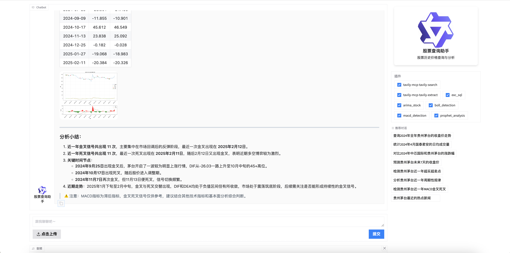

# AlphaSeeker - 智能股票查询与分析

[](LICENSE)
[](https://www.python.org/downloads/)
[](https://github.com/QwenLM/qwen-agent)

基于 [qwen-agent](https://github.com/QwenLM/qwen-agent) 框架的智能股票查询与分析系统，支持自然语言对话、SQL 查询、ARIMA 价格预测、布林带检测和 Prophet 周期性分析。

## 功能特性

- **自然语言查询** - 用中文直接提问，自动转换为 SQL 查询
- **Tavily 搜索** - 集成网络搜索，获取股票相关热点新闻
- **ARIMA 预测** - 基于时间序列分析预测未来价格走势
- **布林带检测** - 识别超买超卖点
- **MACD 指标分析** - 检测金叉死叉信号
- **Prophet 周期分析** - 分析股票价格周期性规律
- **智能图表** - 自动生成统计图表
- **Web 界面** - 基于 Streamlit 的友好交互界面

## 界面演示



## 快速开始

### 1. 安装依赖

```bash
pip install -r requirements.txt
```

> **注意**：`prophet` 需要 C++ 编译工具链（macOS: `xcode-select --install`，Linux: `build-essential`）。

### 2. 配置环境变量

```bash
cp .env.example .env
```

编辑 `.env` 文件，填入你的 API 密钥：

```bash
# 阿里云 DashScope API Key（必填）
DASHSCOPE_API_KEY=your_api_key_here

# Tavily 搜索 API Key（可选，仅在 Search/Full 版本中使用）
TAVILY_API_KEY=your_tavily_api_key_here

# 自定义模型服务地址（可选，默认使用 api.supxh.xin）
MODEL_SERVER_URL=https://api.supxh.xin/v1

# 自定义模型名称（可选，默认使用 deepseek-v4-pro）
LLM_MODEL=deepseek-v4-pro
```

### 3. 准备数据

项目仓库已自带 `stock_data.db` 示例数据库，开箱即用。如需导入自己的数据：

**方案 A：使用 akshare 自行获取数据**

```bash
pip install akshare
```

然后用以下代码获取数据并创建数据库：

```python
import akshare as ak
import sqlite3

# 获取贵州茅台历史数据
df = ak.stock_zh_a_hist(symbol="600519", period="daily", start_date="20230101", end_date="20241231")

conn = sqlite3.connect('stock_data.db')
df.rename(columns={
    '日期': 'trade_date', '股票代码': 'ts_code', '股票名称': 'stock_name',
    '开盘': 'open', '最高': 'high', '最低': 'low', '收盘': 'close',
    '成交量': 'vol', '成交额': 'amount'
}, inplace=True)
df['stock_name'] = '贵州茅台'
df['ts_code'] = '600519.SH'
df.to_sql('stock_price', conn, if_exists='append', index=False)
conn.close()
```

**方案 B：使用 `sqlite_import_stock.py` 脚本导入**

该脚本可从 Excel 文件批量导入数据，需要准备 `stock_history_data.xlsx`（包含所需列）和 `create_stock_price.sql` 建表文件。

> 确保你的数据表结构与下方 `stock_price` 一致即可。

**`stock_price` 表结构**：

```sql
CREATE TABLE stock_price (
    id INTEGER PRIMARY KEY AUTOINCREMENT,
    stock_name TEXT NOT NULL,
    ts_code TEXT NOT NULL,
    trade_date TEXT NOT NULL,
    open REAL,
    high REAL,
    low REAL,
    close REAL,
    vol REAL,
    amount REAL
);
```

### 4. 启动服务

```bash
python stock_query_simple.py  # 基础版 - SQL 查询
python stock_query_search.py  # 搜索版 - + Tavily 搜索
python stock_query_arima.py   # 预测版 - + ARIMA 预测
python stock_query_boll.py    # 分析版 - + 布林带检测
python stock_query_full.py    # 完整版 - 所有功能
```

## 项目结构

```
├── stock_query_simple.py   # 基础版 - SQL 查询
├── stock_query_search.py   # 搜索版 - + Tavily 搜索
├── stock_query_arima.py    # 预测版 - + ARIMA 预测
├── stock_query_boll.py     # 分析版 - + 布林带检测
├── stock_query_full.py     # 完整版 - 所有功能
├── sqlite_import_stock.py  # 数据导入工具
├── stock_data.db           # SQLite 数据库（自带示例数据）
├── faq.txt                 # 常见问题知识库
├── screenshots/            # 截图目录
│   └── demo.png            # 界面演示截图
├── requirements.txt        # Python 依赖
├── .env.example            # 环境变量模板
└── LICENSE                 # Apache License 2.0
```

## 各版本功能对比

| 功能 | Simple | Search | Arima | Boll | Full |
|------|--------|--------|-------|------|------|
| SQL 查询 | ✅ | ✅ | ✅ | ✅ | ✅ |
| Tavily 搜索 | | ✅ | | | ✅ |
| ARIMA 预测 | | | ✅ | ✅ | ✅ |
| 布林带检测 | | | | ✅ | ✅ |
| MACD 指标分析 | | | | | ✅ |
| Prophet 周期分析 | | | | | ✅ |

## 支持的查询示例

- "查询贵州茅台最近的收盘价"
- "查询贵州茅台近一个月的价格走势"
- "预测贵州茅台未来7天的收盘价"
- "检测贵州茅台近一年超买超卖点"
- "检测贵州茅台近一年MACD金叉死叉"
- "分析贵州茅台近一年周期性规律"
- "贵州茅台最近的热点新闻"

## 环境变量说明

| 变量名 | 必填 | 默认值 | 说明 |
|--------|------|--------|------|
| `DASHSCOPE_API_KEY` | 是 | - | 阿里云 DashScope API Key |
| `TAVILY_API_KEY` | 否 | - | Tavily 搜索 API Key |
| `MODEL_SERVER_URL` | 否 | `https://api.supxh.xin/v1` | 模型服务地址 |
| `LLM_MODEL` | 否 | `deepseek-v4-pro` | 模型名称 |

## 本地 / 私有化部署

本项目默认使用 `deepseek-v4-pro` 模型（通过 `https://api.supxh.xin/v1` 服务）。如需切换模型：

1. 设置 `MODEL_SERVER_URL` 为你的模型服务地址（如 Ollama、vLLM、阿里云百炼等）
2. 设置 `LLM_MODEL` 为对应的模型名称
3. 设置 `DASHSCOPE_API_KEY` 或 `OPENAI_API_KEY`（如果服务需要认证）

## 贡献指南

欢迎提交 Issue 和 Pull Request 来改进项目。在贡献前，请：

1. 从 `dev` 分支创建你的功能分支
2. 确保代码可正常运行
3. 在 PR 中说明变更内容和原因

## 注意事项

- Search/Full 版本需要 Node.js 环境支持 Tavily MCP 工具
- 数据库使用本地 SQLite，需用户自行准备数据
- 预测结果仅供参考，不构成投资建议

## License

[Apache License 2.0](LICENSE)
